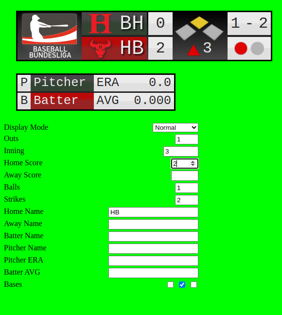

# Baseball Scoreboard

Customizable Baseball Scoreboard as a web component. 
Great for usage in a live ticker web application or live streams.

## Features

* Scoreboard display
* Pitcher/Batter name display with statistics
* Configurable colors, shadows and logos for each team
* Configurable colors for inning, outs and base indicators
* Optionally add a brand logo to the scoreboard

## Usage

Install with `npm install @hardbulls/baseball-scoreboard`.

See [index.html](./index.html) for example usage.

## Demo

https://hardbulls.github.io/baseball-scoreboard

Check out our [YouTube](https://www.youtube.com/@hardbullsbaseball/streams) to see it used in our livestreams.

## Development

`npm install`  
`npm start`
